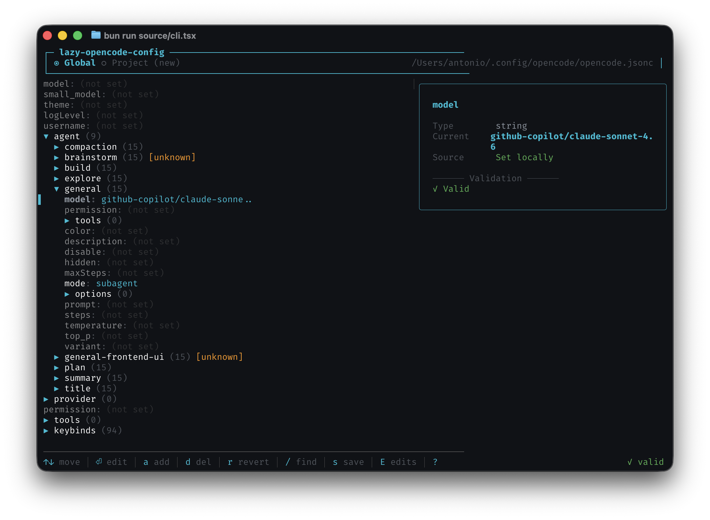

# lazy-opencode-config

A CLI + interactive TUI for managing your [opencode](https://opencode.ai) configuration.



## What it does

- Browse and edit your `opencode.json`/`opencode.jsonc` config with a searchable, tree-based TUI
- Get, set, and delete config values from the command line
- Validates your config against the live opencode schema
- Preserves comments and formatting in your JSONC files
- Auto-detects global (`~/.config/opencode/opencode.jsonc`) vs. project-level config
- Creates timestamped backups before saving

## Install

```bash
npm install --global lazy-opencode-config
```

## Usage

### Interactive TUI

```bash
lazy-opencode-config
```

Launches a terminal UI to browse, search, and edit your config interactively.

### Commands

```bash
lazy-opencode-config get <path>          # Read a value (e.g. agent.model)
lazy-opencode-config set <path> <value>  # Update a value
lazy-opencode-config delete <path>       # Remove a key
lazy-opencode-config list providers      # List available providers
lazy-opencode-config list models         # List available models
lazy-opencode-config list agents         # List configured agents
lazy-opencode-config list keys           # List config keys
lazy-opencode-config validate            # Validate config against schema
lazy-opencode-config path                # Show active config file location
```

### Flags

| Flag         | Description                                                 |
| ------------ | ----------------------------------------------------------- |
| `--global`   | Use the global config (`~/.config/opencode/opencode.jsonc`) |
| `--project`  | Use the project-level config                                |
| `--provider` | Filter models by provider (with `list models`)              |

## Development

```bash
bun install
bun run dev
bun run build
bun run test
```
